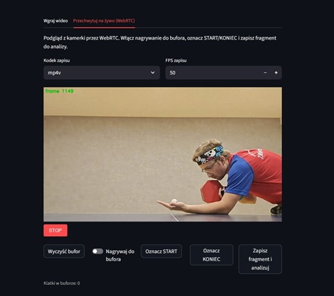

# VAR Table Tennis Service Analysis System

## Overview
This project provides a system for analyzing table tennis services using computer vision and machine learning. It includes detection, tracking, and GUI components developed in Python.

---

## Setup Instructions

### 1. Prerequisites
- Python 3.8 or newer (download from [python.org](https://www.python.org/downloads/)).
- Git (download from [git-scm.com](https://git-scm.com/downloads/)).
- Streamlit: Python library to run the GUI.

### 2. Clone the Repository
`git clone https://github.com/radoslawierzbicki/VAR_table_tennis.git`
`cd VAR_table_tennis`

### 3. Install Dependencies
Install required Python libraries:
`pip install streamlit torch opencv-python numpy`

## How to Run
Launch the application GUI with the command:
`streamlit run GUI.py`

This will open a web-based graphical interface

## User Interface Overview
### 1. Loading Video and Starting Analysis

At this stage, the user loads a table tennis serve video, can preview the loaded media, and start the serve analysis by clicking the **Start Analysis** button. The status bar indicates the progress (e.g., "Analyzing...").

---

### 2. Serve Evaluation Results

Once analysis is complete, this screen displays the serve's validity status (e.g., "ILLEGAL SERVE") along with key parameters such as toss height, serve angle, and ball visibility percentage. Important frame timestamps and serve metrics are also shown, supplemented by annotated video frames explaining the decision.

---

### 3. Detailed Visualization and Hidden Ball Frames

This view provides a visualization of the serve's trajectory and angle using graphical markers overlaid on video frames. Thumbnails of frames where the ball was hidden are shown below, assisting in identifying serve faults and verifying ball visibility throughout the serve.

---

### 4. Live Capture Panel and Buffer Controls

This panel allows capturing serve video live from a connected camera using WebRTC. Controls permit starting/stopping recording, marking clips for analysis using **Start** and **End** buttons, clearing the buffer, and selecting codec and FPS settings. The live frame preview updates in real-time with frame number display.

---

### Button Descriptions:

- **Load Video**: Opens file dialog for selecting recorded serve videos.
- **Start Analysis**: Begins automated serve detection and evaluation.
- **Pause/Resume**: Temporarily pause or continue current processing.
- **Settings**: Opens parameter configuration, including calibration and detection thresholds.
- **Export Results**: Saves processed video and analysis reports.
- **Live Capture**: Switch to real-time video capture mode.
- **Select Device**: Choose input camera device for live feed.
- **Start/Stop Capture**: Control live recording session for instant analysis.
- **Clear Buffer**: Erase recorded frames waiting for processing.
- **Exit**: Close the application interface.

---

## Additional Notes

- The `wynik/` folder is ignored by Git and holds output and temporary result files.
- The system supports both pre-recorded video analysis and real-time analysis via live camera feed.
- Calibration options allow adjustment according to the recording setup to improve accuracy.
- The application displays key frames marking important serve moments such as ball toss, highest point, and serve end.
- Results include visual markers signaling valid or invalid serve criteria, along with slow-motion replay.
- For best results, use a high-quality camera setup for recording or live capture.
- The project is intended primarily for table tennis serve legality assessment and can contribute to fair and objective refereeing.

---
